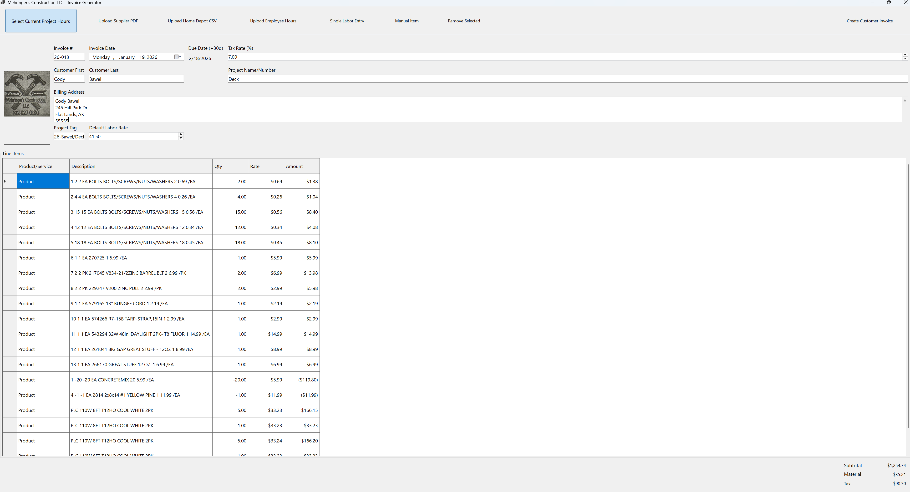
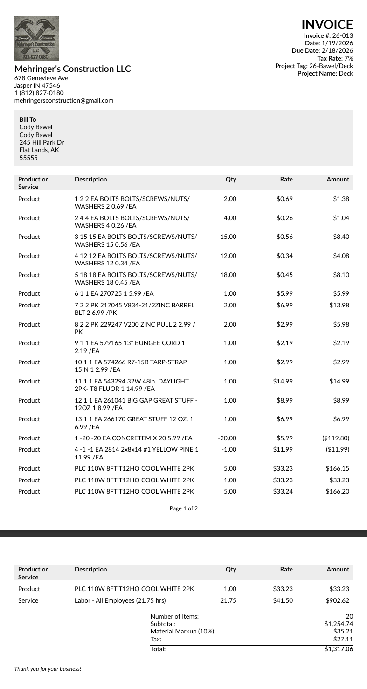
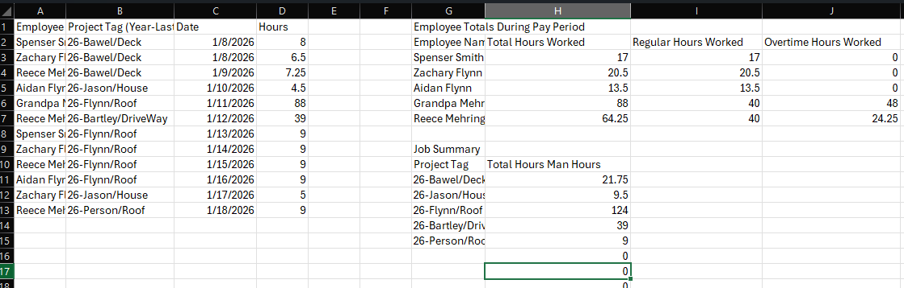

# Invoice Generator Demo

Desktop invoice generation software built in **C# (WinForms)** for a small construction company.  
Designed to automate invoice creation, employee hour tracking, and structured data export.

##  Why This Project Exists
Small construction and trade businesses often rely on manual invoice creation, spreadsheets,
and inconsistent record keeping. This project demonstrates how a **custom desktop tool**
can streamline billing, reduce errors, and prepare data for analytics or AI-assisted workflows.

##  Core Features
- Automated invoice generation
- PDF → CSV data parsing
- Employee hour tracking modules
- Modular architecture for future expansion
- Desktop-first workflow (offline-friendly)

##  Tech Stack
- **Language:** C#
- **Framework:** .NET (WinForms)
- **IDE:** Visual Studio
- **Data Formats:** PDF, CSV

##  Engineering Focus
- Separation of UI and business logic
- Modular design for scalability
- Real-world constraints (small business workflow, non-technical users)

##  Screenshots

### Main Dashboard

*Primary interface for invoice creation and workflow management.*

### Invoice Preview

*Preview of generated invoices prior to PDF export.*

### Employee Hour Tracking

*Automated aggregation of employee hours with regular and overtime breakdowns.*

##  Project Status
Active development / demo repository  
Built as a foundation for a production-ready small business tool.
